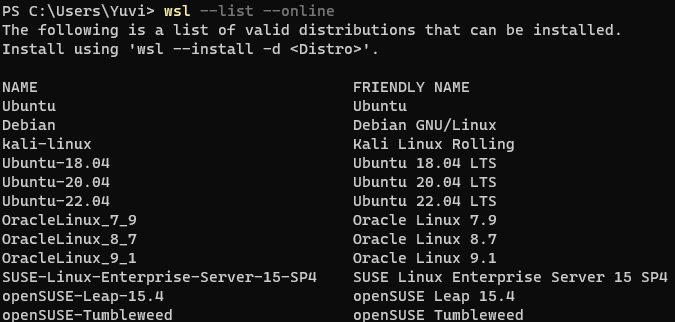
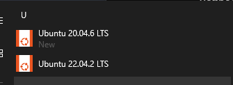
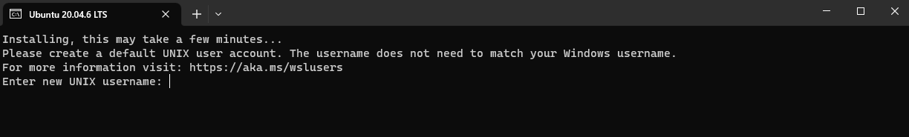
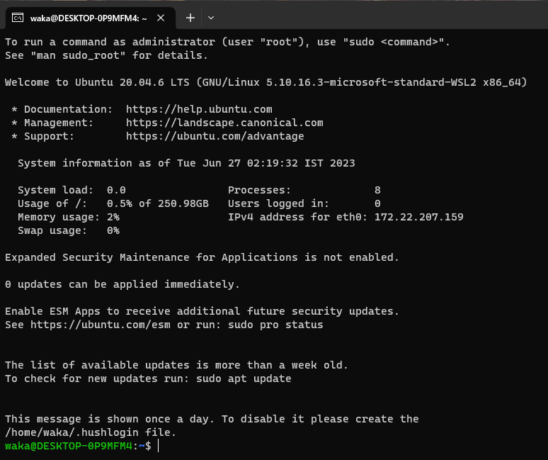
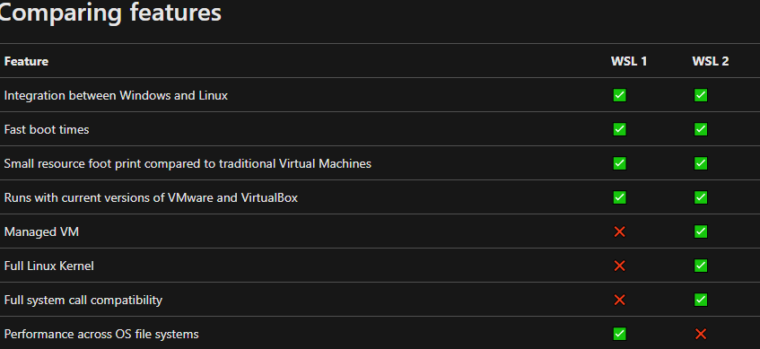

## Prerequisites
You must be running **Windows 10 version 2004 and higher (Build 19041 and higher) or Windows 11** to use the commands below. 
​
## Install WSL
1.  Open PowerShell or Windows Command Prompt in administrator mode by right-clicking and selecting "Run as administrator",
2.  enter the `wsl --install` command, then restart your machine.
​
This command will enable the features necessary to run WSL and install the Ubuntu distribution of Linux. (This default distribution can be changed).
​
Alternatively you can also Specify the Linux distribution to install
For a valid list of distribution names, run `wsl --list --online`.

​
Example `wsl --install --distribution Ubuntu-20.04`

​

​
3.  You will find the downloaded linux distribution in start menu, Open it

​

​

4.  After a few minutes you will be able to setup your linux

​

​
5.  Type in a Username, Password    
6.  Voila you are in
    
​

# Recommended WSL Practices
## Upgrade to WSL 2

​

​
The primary differences between WSL 1 and WSL 2 are the use of an actual Linux kernel inside a managed VM, support for full system call compatibility, and performance across the Linux and Windows operating systems. WSL 2 is the current default version when installing a Linux distribution and uses the latest and greatest in virtualization technology to run a Linux kernel inside of a lightweight utility virtual machine (VM).

